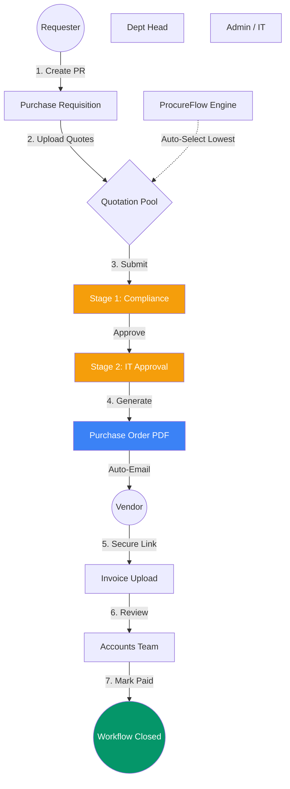
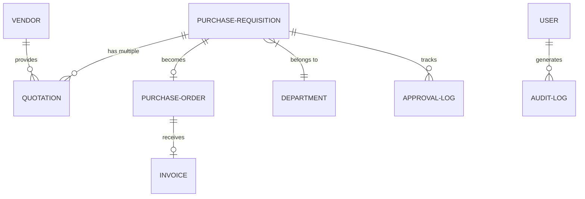
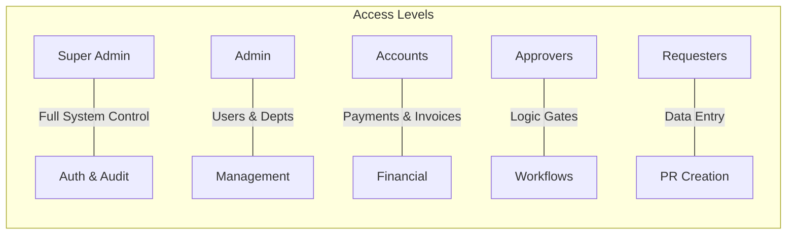

# ⚙️ ProcureFlow: Enterprise Procure-to-Pay System

ProcureFlow is a sophisticated, data-driven workflow engine designed to automate the complete procurement lifecycle—eliminating manual bottlenecks from initial request to final vendor payment.

---

## 🏗 System Architecture

To help you understand how ProcureFlow handles complex business logic, we've broken down the architecture into three primary perspectives:

### 1. The Core Lifecycle (Business Process)
This diagram illustrates the journey of a single Purchase Requisition (PR) as it transforms into a closed payment.

### 2. Data & Relationship Model
How the system maintains data integrity across different entities.

### 3. Security & Role Permissions
ProcureFlow uses a strict Role-Based Access Control (RBAC) system.

---

## 🌟 Key Capabilities

- **⚡ Zero-Login Vendor Portal**: Vendors interact with the system via unique, secure tokens. No passwords required for them to upload invoices.
- **🛡️ Multi-Stage Guardrails**: PRs cannot bypass approval stages. The system enforces compliance at every step.
- **📧 Automated Notifications**: Built-in integration with **Brevo (SMTP)** for instant alerts to Requesters, Approvers, and Vendors.
- **📄 Pro-Grade PDF Engine**: Generates clean, professional Purchase Orders with unique tracking numbers and secure links.
- **🔍 Forensic Audit Logs**: Every click is recorded. Know exactly who approved, rejected, or modified any record at any time.

---

## 🛠 Tech Stack

- **Backend**: Laravel 12 (Modern PHP)
- **Database**: SQLite (Optimized for persistence and speed)
- **Mailing**: Brevo SMTP Relay
- **Design**: Tailwind CSS & Alpine.js (Lightweight & Reactive)
- **Diagramming**: Mermaid.js Integrated

---

## 🚀 Getting Started

1.  **Clone**: `git clone https://github.com/zaidinabeel/po_workflow.git`
2.  **Install**: `composer install && npm install && npm run build`
3.  **Config**: `cp .env.example .env && php artisan key:generate`
4.  **Database**: `php artisan migrate --seed`
5.  **Run**: `php artisan serve`

## 📄 Deployment
For hosting on a VPS or **Hostinger**, see our [Step-by-Step Deployment Guide](deployment_guide.md).
